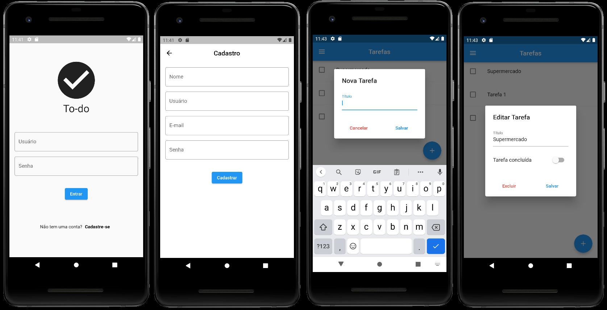

# PHP API TO-DO-LIST v.2.0

<code></code>
<code></code>

This API aims to present a brief to consume an API resources, mainly for students in the early years of Computer Science courses and the like. For this reason, it has few EndPoints to use, and can be expanded according to the need.

The API have two features: "**USER**" and "**TASK**". The aim is that a user can register their to-do list, performing basic data manipulation on both resources. As a bonus, the API allows, after creating the user, sending an image to the user's profile.

As it is an instructional project, **it is not recommended** that it be applied in a production environment, as safety routines and tests have not been implemented. These resources must be researched and implemented, following the current rules, in addition to good practices. Built in **PHP 7** (see below), it allows the beginner to understand the mechanisms of access to the resources of an API.

```html
PHP 7.4.3 (cli) (built: Jul  5 2021 15:13:35) ( NTS )
Copyright (c) The PHP Group Zend Engine v3.4.0, 
Copyright (c) Zend Technologies with Zend OPcache v7.4.3, 
Copyright (c), by Zend Technologies
```

## How to use this content?

This content has _free license for use_ (CC BY-SA 4.0).

If you want to collaborate in this repository with any improvements you have made. To do this, just make a Fork and send Pull Requests.

## Composer

Changes should be updated via <code>composer dump-autoload -o</code> on your local machine.

## Documentation

This API provides functionality for creating and maintaining users to control a simple To-Do-List application. The following shows the API structure for **users** and **tasks** resources.

## API Structure

```text
+---api
    \task\
        ---delete
        ---edit
        ---new
        ---search
        ---update
    \user\
        ---new
        ---login
        ---update
        ---updateuserpass
        ---delete
+---src
    \---Database
    \---Helpers
    \---Task
    \---User
\---vendor
    \---composer
```

## Database

The development uses the MySQL 5, which can be changed at any time according to the need for use. The database should be
configured in <code>Database\Database.php</code>

### Scripts SQL

```sql
CREATE DATABASE name;
```

```sql
CREATE TABLE users
(
    id       INT(3)         NOT NULL PRIMARY KEY AUTO_INCREMENT,
    name     VARCHAR(50)    NOT NULL,
    email    VARCHAR(50)    NOT NULL,
    username VARCHAR(32)    NOT NULL,
    password VARCHAR(32)    NOT NULL,
    token    VARCHAR(20)    NOT NULL,
    picture  TEXT           DEFAULT NULL
);
```

```sql
CREATE TABLE tasks
(
    id       INT(3)         NOT NULL PRIMARY KEY AUTO_INCREMENT,
    userId   INT(3)         NOT NULL,
    name     VARCHAR(50)    NOT NULL,
    date     date           NOT NULL,
    realized INT(1)         NOT NULL
);
```

Attention: in order to delete corresponding tasks to user you need to do a ```ALTER TABLE``` adding a ```FOREIGN KEY``` and ```ON DELETE CASCADE``` option.

```sql
ALTER TABLE tasks
ADD CONSTRAINT pk_user
FOREIGN KEY (userId)
REFERENCES users(id)
ON DELETE CASCADE;
```

## Token

To use this API, a user must first be created with resource below.

A TOKEN will be returned that should be used in all subsequent requests for both user and task data manipulation.

## Domain

The `domain` variable must be filled with the address where the API will be made available like: (<code>https://**domain**/api/{resource}/{parameter}</code>)

# __User__ resources

## **NEW**

* parameter: **user/new**/
* method: **post**
* payload

  ```json
  {
    "name": "name",
    "email": "email",
    "username": "username",
    "password": "password"
  }
  ```

* header

  ```json
  {"content-type": "application/json"}
  ```

* Success

  ```json
  {
    "message": "User Successfully Added",
    "id": "user_id",
    "token": "YOUR_TOKEN"
  }
  ```

* Warnings

  ```json
  {"message": "Invalid Arguments Number (Expected Four)"}
  {"message": "Could Not Add User"}
  {"message": "User Already Exists"}
  ```


## **LOGIN**

* parameter: **user/login**/
* method: **post**
* payload

  ```json
  {
    "username": "username",
    "password": "password"
  }
  ```

* header

  ```json
  {"content-type": "application/json"}
  ```

* Success

  ```json
  {
    "id": 1,
    "name": "John Doe",
    "email": "john.doe@domain.com",
    "token": "YOUR_TOKEN",
    "picture": "BASE64_STRING"
  }
  ```

* Warnings

  ```json
  {"message": "Invalid Arguments Number (Expected Two)"}
  {"message": "Incorrect username and/or password"}
  ```
  
## **UPDATE**

* parameter: **user/update/**
* method: **put**
* payload

  ```json
  {
    "name": "name",
    "email": "email",
    "username": "username",
    "password": "password",
    "picture": "BASE64_STRING" or ""
  }
  ```

* header

  ```json
  {
    "content-type": "application/json",
    "Authorization": "YOUR_TOKEN"
  }
  ```

* Success

  ```json
  {"message": "User Successfully Updated"}
  ```

* Warnings

  ```json
  {"message": "Invalid Arguments Number (Expected Five)"}
  {"message": "Incorrect username and/or password"}
  {"message": "Could Not Update User"}
  ```

## **UPDATE USERNAME/PASSWORD**

* parameter: **user/updateuserpass/**
* method: **put**
* payload

  ```json
  {
    "username": "username",
    "password": "password",
    "new_username": "new_username",
    "new_password": "new_password"  
  }
  ```

* header

  ```json
  {
    "content-type": "application/json",
    "Authorization": "YOUR_TOKEN"
  }
  ```

* Success

  ```json
  {"message": "User/password Successfully Updated"}
  ```

* Warnings

  ```json
  {"message": "Invalid Arguments Number (Expected Four)"}
  {"message": "Incorrect username and/or password"}
  {"message": "Could Not Update Username/password"}
  ```

## **DELETE**

* parameter: **user/delete/**
* method: **delete**
* payload

  ```json
  {
    "username": "username",
    "password": "password"
  }
  ```

* header

  ```json
  {
    "content-type": "application/json",
    "Authorization": "YOUR_TOKEN"
  }
  ```

* Success

  ```json
  {"message": "User Successfully Deleted"}
  ```

* Warnings

  ```json
  {"message": "Invalid Arguments Number (Expected Two)"}
  {"message": "Incorrect username and/or password"}
  {"message": "Could Not Delete User"}
  ```

# __Task__ resources

## **NEW**

* parameter: **task/new**/
* method: **post**
* payload

* payload

  ```json
  {"name": "Task name"}
  ```

* header

  ```json
  {
    "content-type": "application/json",
    "Authorization": "YOUR_TOKEN"
  }
  ```

* Success

  ```json
  {"message": "Task Successfully Added"}
  ```

* Warnings

  ```json
  {"message": "Invalid Arguments Number (Expected One)"}
  {"message": "Could Not Add Task"}
  ```

## **SEARCH**

* parameter: **task/search**/
* method: **post**
* payload
  * Payload is not necessary, as the control is performed by `token`.
  * Realized field accept values: `0` (open) or `1` (realized)

* header

  ```json
  {
    "content-type": "application/json",
    "Authorization": "YOUR_TOKEN"
  }
  ```

* Success

  ```json
  [
    {
      "id": 1,
      "userId": 1,
      "name": "task name",
      "date": "2021-08-16",
      "realized": 0
    }
  ]
  ```

## **UPDATE**

* parameter: **task/update**/
* method: **put**
* payload

  ```json
  {
    "id": "value",
    "name": "Task name",
    "realized": "value"
  }
  ```

* header

  ```json
  {
    "content-type": "application/json",
    "Authorization": "YOUR_TOKEN"
  }
  ```

* Success

  ```json
  {"message": "Task Successfully Updated"}
  ```

* Warnings

  ```json
  {"message": "Task(s) not found"}
  {"message": "Method Not Allowed"}
  {"message": "Invalid Arguments Number (Expected Three)"}
  ```

## **EDIT**

* parameter: **task/edit**/
* method: **put**
* payload

    ```json
    {"id": "value"}
    ```

* header

  ```json
  {
    "content-type": "application/json",
    "Authorization": "YOUR_TOKEN"
  }
  ```

* Success

  ```json
  {
  "id": 2,
  "userId": 1,
  "name": "Task name",
  "date": "2021-08-16",
  "realized": 0
  }
  ```

* Warnings

  ```json
  {"message": "Payload Precondition Failed"}
  {"message": "Invalid or Missing Token"}  
  {"message": "Invalid Arguments Number (Expected One)"}
  {"message": "Bad Request (Invalid Syntax)"}
  {"message": "Token Refused"}
  ```

## **DELETE**

* parameter: **task/delete**/
* method: **delete**

* payload

  ```json
  {"id": "id_task"}
  ```

* header

  ```json
  {
    "content-type": "application/json",
    "Authorization": "YOUR_TOKEN"
  }
  ```

* Success

  ```json
  {"message": "Task deleted Successfully"}
  ```

* Warnings

  ```json
  {"message": "Task not exist"}
  {"message": "Payload Precondition Failed"}
  {"message": "Invalid or Missing Token"}  
  {"message": "Invalid Arguments Number (Expected One)"}
  ```


### Other Warnings

```json
{"message": "Bad Request (Invalid Syntax)"}
{"message": "Token Refused"}
{"message": "Invalid or Missing Token"}
{"message": "Method Not Allowed"}
{"message": "<SQL Code>"}
{"message": "<Unknown>"}
```


<a name="tryonline"></a>

# Try Online

You can try online this API with full features.

* URI: [https://todolist-api.edsonmelo.com.br/api/](https://todolist-api.edsonmelo.com.br/api/)

---

## Flutter APP ToDoList

You can test the API functionalities by accessing [here](https://github.com/Wilian-N-Silva/flutter_to_do_list) the APP developed by [Wilian Silva](https://github.com/Wilian-N-Silva).

### Views


___

## How to cite this content

```
DE SOUZA, Edson Melo (2021, August 16). PHP API TO-DO-LIST v.2.0.
Available in: https://github.com/EdsonMSouza/php-api-to-do-list
```

Or BibTeX for LaTeX:

```latex
@misc{desouza2020phpapi,
  author = {DE SOUZA, Edson Melo},
  title = {PHP API TO-DO-LIST v.2.0},
  url = {https://github.com/EdsonMSouza/php-api-to-do-list},
  year = {2021},
  month = {August}
}
```

## Acknowledgements

* [Arthur Timoteo](https://github.com/arthur-timoteo)
  
* [Wilian Silva](https://github.com/Wilian-N-Silva)

## License

[![CC BY-SA 4.0][cc-by-sa-shield]][cc-by-sa]

This work is licensed under a
[Creative Commons Attribution-ShareAlike 4.0 International License][cc-by-sa].

[![CC BY-SA 4.0][cc-by-sa-image]][cc-by-sa]

[cc-by-sa]: http://creativecommons.org/licenses/by-sa/4.0/

[cc-by-sa-image]: https://licensebuttons.net/l/by-sa/4.0/88x31.png

[cc-by-sa-shield]: https://img.shields.io/badge/License-CC%20BY--SA%204.0-lightgrey.svg
